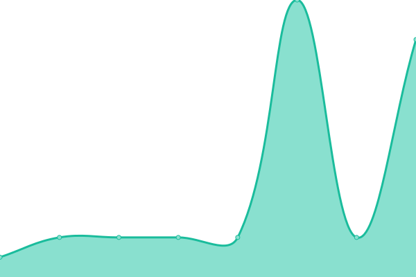
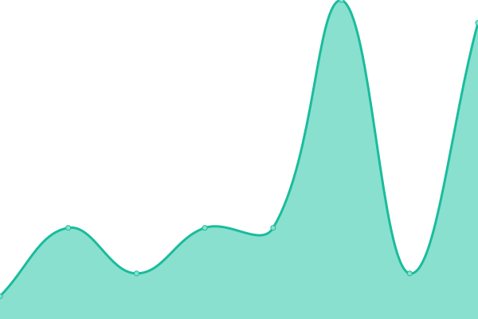
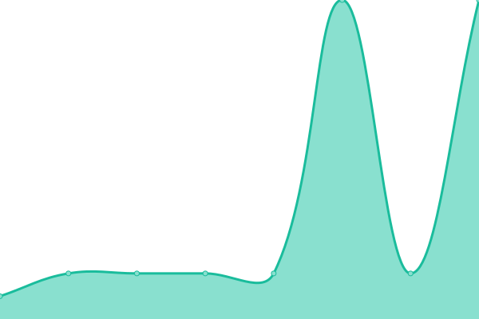
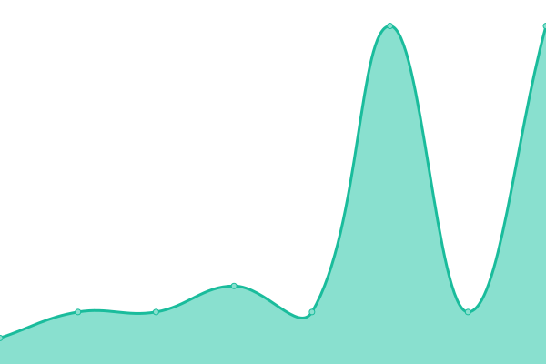
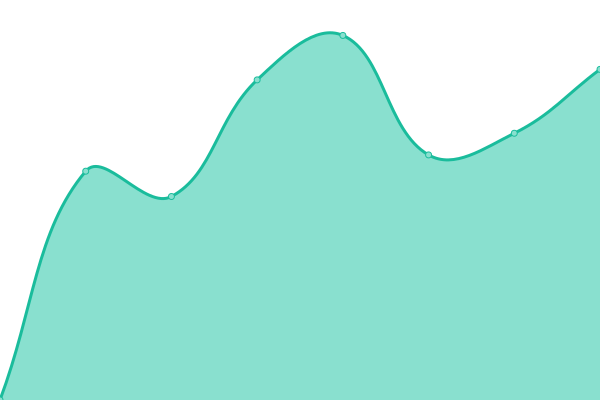

# [📈 Live Status](https://status.djstraka.com): <!--live status--> **🟩 All systems operational**

This repository contains the open-source uptime monitor and status page for [jakub-straka](https://status.djstraka.com), powered by [Upptime](https://github.com/upptime/upptime).

With [Upptime](https://upptime.js.org), you can get your own unlimited and free uptime monitor and status page, powered entirely by a GitHub repository. We use [Issues](https://github.com/jakub-straka/djstraka-detector/issues) as incident reports, [Actions](https://github.com/jakub-straka/djstraka-detector/actions) as uptime monitors, and [Pages](https://status.djstraka.com) for the status page.

<!--start: status pages-->
<!-- This summary is generated by Upptime (https://github.com/upptime/upptime) -->
<!-- Do not edit this manually, your changes will be overwritten -->
<!-- prettier-ignore -->
| URL | Status | History | Response Time | Uptime |
| --- | ------ | ------- | ------------- | ------ |
|  [Google DNS 1](8.8.4.4) | 🟩 Up | [google-dns-1.yml](https://github.com/jakub-straka/djstraka-detector/commits/HEAD/history/google-dns-1.yml) | 

 4ms
     
 | 

<a href="https://status.djstraka.com/history/google-dns-1">100.00%</a>
    

|  [Google DNS 2](8.8.8.8) | 🟩 Up | [google-dns-2.yml](https://github.com/jakub-straka/djstraka-detector/commits/HEAD/history/google-dns-2.yml) | 

 4ms
     
 | 

<a href="https://status.djstraka.com/history/google-dns-2">100.00%</a>
    

|  [CloudFlare DNS 1](1.1.1.1) | 🟩 Up | [cloud-flare-dns-1.yml](https://github.com/jakub-straka/djstraka-detector/commits/HEAD/history/cloud-flare-dns-1.yml) | 

 4ms
     
 | 

<a href="https://status.djstraka.com/history/cloud-flare-dns-1">100.00%</a>
    

|  [CloudFlare DNS 2](1.0.0.1) | 🟩 Up | [cloud-flare-dns-2.yml](https://github.com/jakub-straka/djstraka-detector/commits/HEAD/history/cloud-flare-dns-2.yml) | 

 4ms
     
 | 

<a href="https://status.djstraka.com/history/cloud-flare-dns-2">100.00%</a>
    

|  [DJ Straka Cloud](https://cloud.djstraka.com) | 🟩 Up | [dj-straka-cloud.yml](https://github.com/jakub-straka/djstraka-detector/commits/HEAD/history/dj-straka-cloud.yml) | 

 1183ms
     
 | 

<a href="https://status.djstraka.com/history/dj-straka-cloud">100.00%</a>
    

|  [Lucas Barbershop](https://lucasbarbershop.sk) | 🟩 Up | [lucas-barbershop.yml](https://github.com/jakub-straka/djstraka-detector/commits/HEAD/history/lucas-barbershop.yml) | 

 1791ms
     
 | 

<a href="https://status.djstraka.com/history/lucas-barbershop">100.00%</a>
    

|  [RRaw](https://rraw.sk) | 🟩 Up | [r-raw.yml](https://github.com/jakub-straka/djstraka-detector/commits/HEAD/history/r-raw.yml) | 

 3528ms
     
 | 

<a href="https://status.djstraka.com/history/r-raw">100.00%</a>
    

|  [Woof Pack](https://woofpack.sk) | 🟩 Up | [woof-pack.yml](https://github.com/jakub-straka/djstraka-detector/commits/HEAD/history/woof-pack.yml) | 

 3530ms
     
 | 

<a href="https://status.djstraka.com/history/woof-pack">100.00%</a>
    

<!--end: status pages-->

[**Visit our status website →**](https://status.djstraka.com)

## 📄 License

- Powered by: [Upptime](https://github.com/upptime/upptime)
- Code: [MIT](./LICENSE) © [Anand Chowdhary](https://anandchowdhary.com), supported by [Pabio](https://pabio.com)
- Data in the `./history` directory: [Open Database License](https://opendatacommons.org/licenses/odbl/1-0/)
